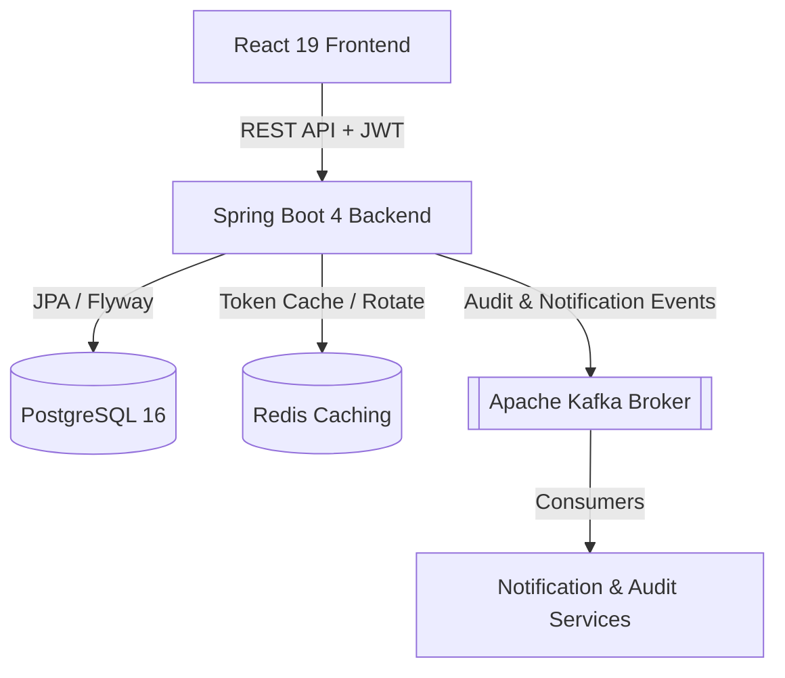
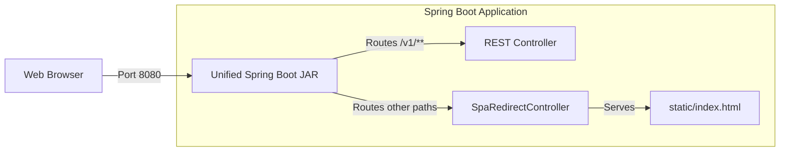
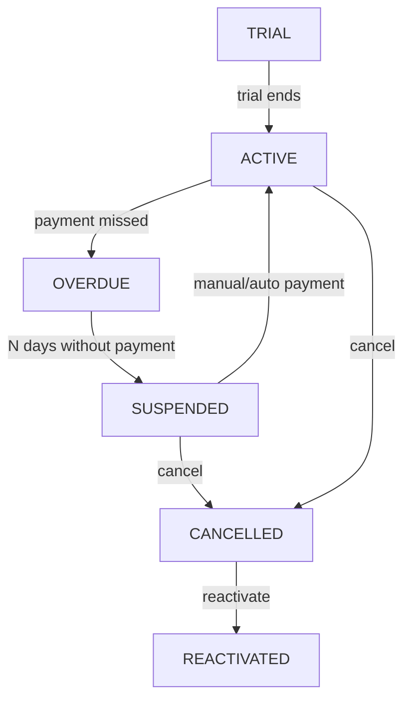

<div align="center">
  

# NEXUM

**A Modern, Production-Ready B2B SaaS Subscription and Customer Management System**

[](https://github.com/OdevMatheus/nexus-monorepo/actions)
[](https://github.com/OdevMatheus/nexus-monorepo/stargazers)
[](https://openjdk.org)
[](https://spring.io/projects/spring-boot)
[](https://react.dev)
[](https://tailwindcss.com)
[](#license)

---

🇧🇷 [Versão em Português](./docs/README.pt-BR.md)

</div>

---

## 📖 What is this?

**Nexum** is an enterprise-grade, high-performance monorepo application designed to manage complex SaaS subscription lifecycles, billing, and B2B customer data. 

Featuring a robust, event-driven backend and a highly responsive, animated frontend, it offers comprehensive tools for modern subscription management and rich customer interaction. It is fully optimized for production readiness, offering options for independent container setups or a single, unified, auto-executable JAR that serves both API and static frontend assets without CORS limitations.

---

## ✨ Key Features

- ⚙️ **Subscription State Machine:** Full manual and automated lifecycle control (Trial, Active, Overdue, Suspended, Cancelled, and Reactivated states) with smart billing cycles that recalculate upon payment to avoid past overdue accruals.
- 📊 **Interactive Metrics & Dashboards:** Sleek, animated charts showing Monthly Recurring Revenue (MRR), Overdue accounts, and Upcoming subscriptions with deep-dive detailed modals and direct action flows.
- 💬 **Unified WhatsApp Notification System:** Integrated WhatsApp-template notification trigger flows mapping localized customer country codes (Brazil `+55`, USA `+1`, Portugal `+351`) for frictionless, prefilled billing and overdue reminders.
- 👤 **Account Settings & Profile Management:** Fully decoupled account portal where authenticated users can edit personal information (Name, Email) and change password securely under strict cryptographic and session invalidation rules.
- 🔄 **Secure Cross-Tab Sessions:** JWT-based secure sessions backed by Redis and persisted via `localStorage` with Refresh Token Rotation, allowing up to 7-day persistent logins, automated dashboard routing, and immediate session termination upon sensitive profile updates.
- ⚡ **Event-Driven Architecture:** Decoupled audit logs, metric compilation, and notification dispatching leveraging Apache Kafka brokers.
- 📦 **Unified Production Packaging:** Single Page Application (SPA) routing through a custom `SpaRedirectController` that forwards browser reloads (e.g., `/dashboard`, `/settings`) directly to `/index.html`, allowing both frontend and backend to run seamlessly on a single port (`8080`) under a unified JAR.
- 🌱 **Robust Local Seeding:** Seed scripts that pre-populate realistic gym memberships (*Carlos' FitLife Gym*), subscriptions, faturations, and transactions spanning a 2.4-year history for immediate visual testing.

---

## 🏗️ Architecture

### System Architecture
Nexum utilizes a decoupled, event-driven architecture to keep key domains scalable and highly performant.



### Production Deployment (Unified Package)
For seamless deployment, Nexum is packaged as a single, containerized run-time image where the Spring Boot JAR hosts and routes the built React frontend locally.



### Subscription Lifecycle State Machine
The core billing engine of Nexum is governed by a deterministic state machine:



---

## 🛠️ Technology Stack

### Backend
- **Java 25** + **Spring Boot 4.0.6** (using Spring Security, Spring Data JPA, and Spring Kafka)
- Relational mapping with **Hibernate 7** and schema migrations managed via **Flyway**
- JWT Token management (HS512 algorithm with UUID subjects) using **JJWT 0.12.6**
- Session and Token Cache with **Redis**
- Custom Validation annotations and Decoupled REST error handlers (`GlobalExceptionHandler`)

### Frontend
- **React 19** + **TypeScript** + **Vite 8** (Build tool)
- Tailwind CSS v4 (`@tailwindcss/vite`) & Vanilla CSS
- State/Server Sync with **TanStack React Query**
- Animations and feedback loops with **Framer Motion** & **Lucide Icons**

### Infrastructure & Orchestration
- **PostgreSQL 16** (Primary Database)
- **Redis** (Session & Token Cache)
- **Apache Kafka** (Event Broker / Message Bus)
- **Docker** & **Docker Compose** (Local Environment Orchestration)

---

## 🚀 Getting Started

### Prerequisites
Ensure you have the following installed locally:
- **Docker** & **Docker Compose**
- **Java 25** (JDK) and **Node.js v20** (Required only for Developer Mode)

---

### Option A: Quick Start (One-Click Local Execution)

The easiest way to start, test, and run the entire application locally. It provisions Docker containers in the background, cleans up any previous port or container conflicts, seeds realistic metrics history, and launches the application automatically based on your choice.

1. **Start the Application:**
   Run the following command in your terminal (Works identically on Windows, Mac, or Linux):
   ```bash
   make dev
   ```
   *(Note: If you don't have `make` installed on Windows, you can double-click `scripts/run.cmd` instead).*

2. **Choose Execution Mode:**
   - **Mode [1] Development Mode:** Starts separate hot-reloading servers (Frontend on port `5173`, Backend on `8080`). Ideal for active coding.
   - **Mode [2] Unified Mode:** Automatically compiles the React SPA, copies files into the Spring Boot static resource folder, and launches a single unified instance on port `8080`. Perfect for staging, testing, and showcasing.

3. **Access the Application:**
   - **Unified Application / Backend API:** `http://localhost:8080` (In Unified Mode, access this url)
   - **Frontend UI (Dev Mode):** `http://localhost:5173` (In Dev Mode, access this url)
   - **API Documentation (Swagger UI):** `http://localhost:8080/swagger-ui/index.html`

*Default Login Credentials:* `teste@teste` / `teste123` (Carlos' FitLife Gym admin user)

*To stop the application:* Simply close the opened terminal windows (or `Ctrl+C`).
*To reset the entire environment (containers, volumes, local builds):* Run `make clean` or execute `scripts/clean-all.cmd`.

---

### Option B: Developer Mode (Manual Execution)

Use this mode if you want to run backend and frontend in local watch/development environments.

#### 1. Infrastructure Setup
Spin up the PostgreSQL, Redis, and Kafka services:
```powershell
cd docker
docker compose up -d
```
*Services run at:* PostgreSQL (`localhost:5432`), Redis (`localhost:6379`), Kafka (`localhost:9092`).

#### 2. Backend Configuration & Execution
Create a `.env` file inside the `backend/` directory with the following variables:
```env
JWT_SECRET=your_jwt_secret_key_minimum_512_bits_long
RESEND_API_KEY=re_your_resend_api_key
RESEND_FROM_EMAIL=onboarding@resend.dev
APP_BASE_URL=http://localhost:8080
```

Start the Spring Boot server:
```powershell
cd backend
.\mvnw clean compile
.\mvnw spring-boot:run
```

#### 3. Frontend Configuration & Execution
Install dependencies and start the Vite development server:
```powershell
cd frontend
npm install
npm run dev
```

---

### Option C: Docker Full-Stack Profile (Cross-Platform)

Ideal for MacOS, Linux, or environments without Node.js and Java installed locally. This spins up the databases AND builds/runs the entire application inside Docker in a single step using Docker Profiles.

```powershell
cd docker
docker compose --profile full up -d --build
```
*Access the Unified Application at:* `http://localhost:8080`
*Default Login Credentials:* `teste@teste` / `teste123`

---

## 🧪 Testing & Validation

### Backend Testing (Unit & Integration)
Integration tests extend `IntegrationTestBase` and spin up ephemeral Postgres/Kafka instances utilizing **Testcontainers** to validate transaction safety without modifying your local database.
To run the full test suite:
```powershell
cd backend
.\mvnw test
```

### Frontend Linters & Build Checks
To run the code linter and the TypeScript compiler validation checks:
```powershell
cd frontend
npm run lint
npx tsc --noEmit
```

---

## 📁 Project Structure

```
.github/
└── workflows/
    └── ci.yml
backend/
├── src/
│   ├── main/
│   │   ├── java/com/matheushenrique/nexum/
│   │   │   ├── config/             # Security, CORS, SPA Redirection
│   │   │   ├── controllers/        # Auth, Clients, Users/Settings, Metrics
│   │   │   ├── dtos/               # Request and Response Java Records
│   │   │   ├── entities/           # JPA Entities with Lombok annotations
│   │   │   ├── messaging/          # Kafka Event Producers & Consumers
│   │   │   ├── repositories/       # JPA Repositories
│   │   │   └── services/           # Service Interfaces & Implementations
│   │   └── resources/
│   │       ├── db/migration/       # Flyway SQL migrations (V1 to V10)
│   │       └── application.yaml    # Configured dynamically for production
│   └── test/
│       ├── java/                   # Unit and Integration Tests (Testcontainers)
│       └── resources/
├── mvnw
├── mvnw.cmd
└── pom.xml
docker/
└── docker-compose.yml
docs/
├── specs/                          # Design and Architecture Specs
└── README.pt-BR.md                 # Portuguese documentation
frontend/
├── public/
│   └── favicon.svg
├── src/
│   ├── components/                 # Modals, Charts, Landing & Layout UI
│   ├── contexts/                   # AuthContext & ThemeContext
│   ├── hooks/                      # Custom hooks wrapping React Query
│   ├── pages/                      # Page components (Dashboard, Settings, Auth)
│   ├── services/                   # Axios API service endpoints
│   ├── styles/                     # Tailwind v4 globals
│   └── Utils/                      # Text/Phone parsing & dynamic title effects
├── eslint.config.js
├── index.html
├── package.json
└── vite.config.ts
clean-all.cmd                       # Full environment cleanup script
Dockerfile                          # Multi-stage production Dockerfile
run.cmd                             # Unified / Dev interactive startup script
```

---

## 📖 Documentation

| Resource | Description |
|---|---|
| [Backend API Module](./backend/README.md) | Detailed documentation on the Java 25 + Spring Boot 4 REST API, testing, and lifecycle. |
| [Frontend App Module](./frontend/README.md) | Detailed documentation on the React 19 + TypeScript SPA, state synchronization, and UX/UI. |
| [Docker Infrastructure Module](./docker/README.md) | Detailed documentation on the Postgres, Redis, and Kafka container services. |
| [Versão em Português (docs/README.pt-BR.md)](./docs/README.pt-BR.md) | Documentação completa do projeto em Português. |

---

## 📄 License

This project is proprietary and confidential. All rights reserved.

---
