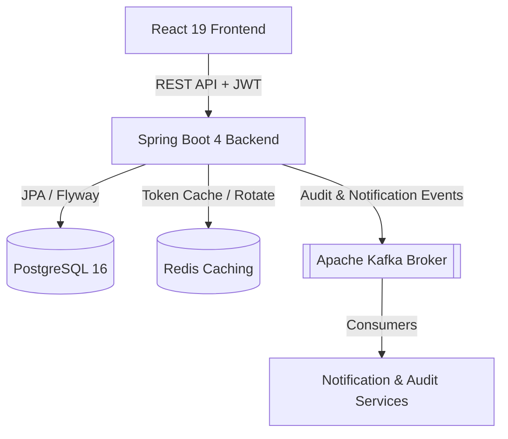
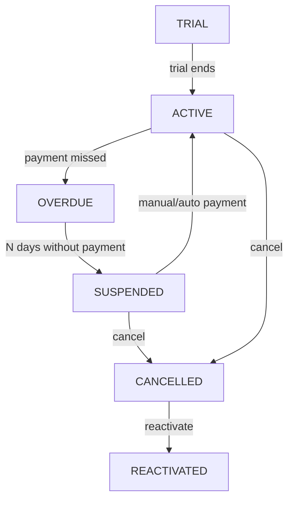

<div align="center">
  

# NEXUM

**A Modern B2B SaaS Subscription and Customer Management System**

[](https://github.com/OdevMatheus/nexus-monorepo/actions)
[](https://github.com/OdevMatheus/nexus-monorepo/stargazers)
[](https://openjdk.org)
[](https://spring.io/projects/spring-boot)
[](https://react.dev)
[](#license)

---

🇧🇷 [Versão em Português](./docs/README.pt-BR.md)

</div>

---

## What is this?

**Nexum** is an enterprise-grade, high-performance monorepo application designed to manage complex SaaS subscription lifecycles, billing, and customer data. Featuring a robust, event-driven backend and a highly responsive, animated frontend, it offers comprehensive tools for modern subscription management and rich customer interaction.

---

## ✨ Key Features

- **Subscription State Machine:** Full manual and automated lifecycle control (Trial, Active, Overdue, Suspended, Cancelled, and Reactivated states) with smart recalculated billing cycles that reset on payment.
- **Interactive Metrics & Dashboards:** Animated charts and metrics showing Monthly Recurring Revenue (MRR), Overdue accounts, and Upcoming subscriptions with deep-dive detailed modals and direct action flows.
- **Unified Notification System:** Integrated WhatsApp-template notification trigger flows mapping localized customer country codes (Brazil +55, USA +1, Portugal +351) for frictionless overdue reminders.
- **Secure Cross-Tab Sessions:** JWT-based secure sessions backed by Redis and persisted via `localStorage` with Refresh Token Rotation, allowing up to 7-day persistent logins and automated dashboard routing.
- **Event-Driven Architecture:** Decoupled audit logs, metric compilation, and notification dispatching leveraging Apache Kafka.
- **Robust Local Seeding:** Seed scripts that pre-populate realistic gym memberships (*Carlos' FitLife Gym*), subscriptions, faturations, and transactions spanning a 2.4-year history for immediate visual testing.

---

## 🏗️ Architecture

### System Architecture
Nexum utilizes a decoupled, event-driven architecture to keep key domains scalable and highly performant.



### Subscription Lifecycle State Machine
The core billing engine of Nexum is governed by a deterministic state machine:



---

## 🛠️ Technology Stack

### Backend
- **Java 25** + **Spring Boot 4.0.6** (using Spring Security, Spring Data JPA, and Spring Kafka)
- Relational mapping with **Hibernate 7** and schema migrations managed via **Flyway**
- JWT Token management (HS512 algorithm with UUID subjects) using **JJWT 0.12.6**
- Decoupled REST error handlers (`GlobalExceptionHandler`)

### Frontend
- **React 19** + **TypeScript** + **Vite 8** (Build tool)
- Tailwind CSS v4 (`@tailwindcss/vite`) & Vanilla CSS
- State/Server Sync with **TanStack React Query**
- Animations and feedback loops with **Framer Motion** & **Lucide Icons**

### Infrastructure & Orchestration
- **PostgreSQL 16** (Primary Database)
- **Redis** (Session & Token Cache)
- **Apache Kafka** (Event Broker / Message Bus)
- **Docker** & **Docker Compose** (Local Environment Orchestration)

---

## 🚀 Getting Started

### Prerequisites
Ensure you have the following installed locally:
- **Docker** & **Docker Compose**
- **Java 25** (JDK) and **Node.js v20** (Required only for Developer Mode)

---

### Option A: Quick Start (One-Click Local Execution)

The easiest way to start, test, and run the entire application locally. It provisions Docker containers in the background, cleans up any previous port or container conflicts, seeds realistic metrics history, and launches both frontend and backend development instances automatically.

1. **Start the Application:**
   Double-click the `run.cmd` file in the root of the project, or run the following command in PowerShell:
   ```powershell
   .\run.cmd
   ```
2. **Access the Application:**
   - **Frontend App:** `http://localhost:5173`
   - **Backend API:** `http://localhost:8080`
   - **API Documentation (Swagger UI):** `http://localhost:8080/swagger-ui/index.html`

*Default Login Credentials:* `teste@teste` / `teste123` (Carlos' FitLife Gym admin user)

*To stop the application:* Simply close the opened terminal windows and stop the docker containers.

---

### Option B: Developer Mode (Manual Execution)

Use this mode if you want to run backend and frontend in local watch/development environments.

#### 1. Infrastructure Setup
Spin up the PostgreSQL, Redis, and Kafka services:
```powershell
cd docker
docker compose up -d
```
*Services run at:* PostgreSQL (`localhost:5432`), Redis (`localhost:6379`), Kafka (`localhost:9092`).

#### 2. Backend Configuration & Execution
Create a `.env` file inside the `backend/` directory with the following variables:
```env
JWT_SECRET=your_jwt_secret_key_minimum_512_bits_long
RESEND_API_KEY=re_your_resend_api_key
RESEND_FROM_EMAIL=onboarding@resend.dev
APP_BASE_URL=http://localhost:8080
```

Start the Spring Boot server:
```powershell
cd backend
.\mvnw clean compile
.\mvnw spring-boot:run
```

#### 3. Frontend Configuration & Execution
Install dependencies and start the Vite development server:
```powershell
cd frontend
npm install
npm run dev
```

---

## 🧪 Testing & Validation

### Backend Testing (Unit & Integration)
Integration tests extend `IntegrationTestBase` and spin up ephemeral Postgres/Kafka instances utilizing **Testcontainers** to validate transaction safety.
To run the full test suite:
```powershell
cd backend
.\mvnw test
```

### Frontend Linters & Build Checks
To run the code linter and the TypeScript compiler validation checks:
```powershell
cd frontend
npm run lint
npx tsc --noEmit
```

---

## 📁 Project Structure

```
.github/
└── workflows/
    └── ci.yml
backend/
├── .mvn/
│   └── wrapper/
│       └── maven-wrapper.properties
├── src/
│   ├── main/
│   │   ├── java/
│   │   └── resources/
│   └── test/
│       ├── java/
│       └── resources/
├── .gitattributes
├── .gitignore
├── mvnw
├── mvnw.cmd
└── pom.xml
docker/
└── docker-compose.yml
docs/
└── README.pt-BR.md
frontend/
├── public/
│   └── favicon.svg
├── src/
│   ├── assets/
│   ├── components/
│   ├── contexts/
│   ├── hooks/
│   ├── pages/
│   ├── routes/
│   ├── services/
│   ├── styles/
│   ├── types/
│   ├── Utils/
│   ├── App.tsx
│   └── main.tsx
├── .gitignore
├── eslint.config.js
├── index.html
├── package-lock.json
├── package.json
├── tsconfig.app.json
├── tsconfig.json
├── tsconfig.node.json
└── vite.config.ts
├── .gitignore
├── README.md
└── run.cmd
```

---

## 📖 Documentation

| Resource | Description |
|---|---|
| [Backend API Module](./backend/README.md) | Detailed documentation on the Java 25 + Spring Boot 4 REST API, testing, and lifecycle. |
| [Frontend App Module](./frontend/README.md) | Detailed documentation on the React 19 + TypeScript SPA, state synchronization, and UX/UI. |
| [Docker Infrastructure Module](./docker/README.md) | Detailed documentation on the Postgres, Redis, and Kafka container services. |
| [Versão em Português (docs/README.pt-BR.md)](./docs/README.pt-BR.md) | Documentação completa do projeto em Português. |

---

## 📄 License

This project is proprietary and confidential. All rights reserved.

---
