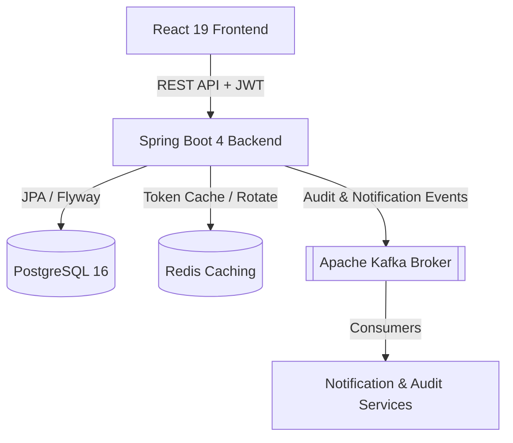
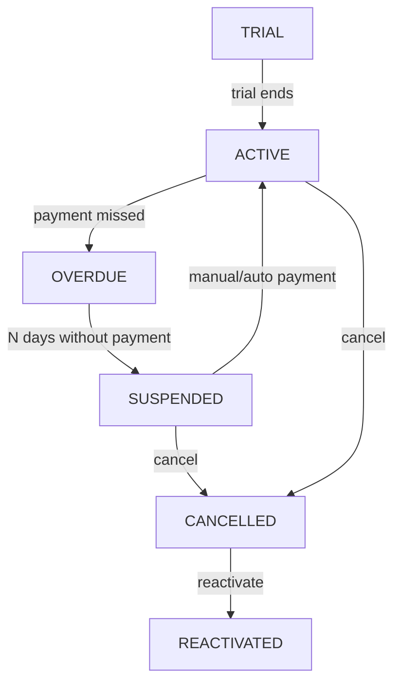

<div align="center">
  

# NEXUM

**A Modern B2B SaaS Subscription and Customer Management System**

[](https://github.com/OdevMatheus/nexus-monorepo/actions)
[](https://github.com/OdevMatheus/nexus-monorepo/stargazers)
[](https://openjdk.org)
[](https://spring.io/projects/spring-boot)
[](https://react.dev)
[](#license)

---

🇧🇷 [Versão em Português](./docs/README.pt-BR.md)

</div>

---

## What is this?

**Nexum** is an enterprise-grade, high-performance monorepo application designed to manage complex SaaS subscription lifecycles, billing, and customer data. It features a robust event-driven backend and a highly responsive, animated frontend.

## ✨ Key Features

- **Subscription State Machine:** Automated and manual control over complex subscription lifecycles (Trial, Active, Overdue, Suspended, Cancelled).
- **Interactive Dashboard:** Rich, animated analytics (`framer-motion`), providing insights into Active Subscriptions by Plan, Monthly Recurring Revenue (MRR), and Overdue/Upcoming payments.
- **Advanced Filtering Engine:** Dynamic search and filtering for subscriptions leveraging Spring Data JPA Specifications.
- **Event-Driven Architecture:** Apache Kafka integration for auditing, notifications, and decoupling business logic.
- **Secure Authentication:** JWT-based authentication with Refresh Token Rotation and Redis-backed session management.

---

## 🏗️ Architecture

### System Architecture
Nexum utilizes a decoupled, event-driven architecture to keep key domains scalable and highly performant.



### Subscription Lifecycle State Machine
The core of Nexum revolves around a deterministic state machine managing the billing cycles:



---

## 🛠️ Technology Stack

### Backend
- **Java 25** + **Spring Boot 4.0.6**
- Spring Security, Spring Data JPA, Spring Kafka
- Database Migrations with **Flyway**
- JWT (JJWT) for Auth

### Frontend
- **React 19** + **TypeScript**
- **Vite 8** (Build tool)
- **Tailwind CSS v4** (`@tailwindcss/vite`)
- React Query (TanStack), Framer Motion, Lucide Icons

### Infrastructure & Orchestration
- **PostgreSQL 16** (Primary Database)
- **Redis** (Token & Cache Management)
- **Apache Kafka** (Event Bus / Messaging)
- **Docker Compose** (Local Environment)

---

## 🚀 Getting Started

### Prerequisites
Before you begin, ensure you have the following installed on your machine:
- **Java 25** (JDK)
- **Node.js** (v20+ recommended) & **npm**
- **Docker** & **Docker Compose**

### 1. Infrastructure Setup
Start the local infrastructure (Database, Cache, and Message Broker) using Docker:
```powershell
cd docker
docker compose up -d
```
*Services run at:* PostgreSQL (`localhost:5432`), Redis (`localhost:6379`), Kafka (`localhost:9092`).

### 2. Backend Configuration & Execution
Create a `.env` file inside the `backend/` directory with the following variables:
```env
JWT_SECRET=your_jwt_secret_key_minimum_512_bits_long
RESEND_API_KEY=re_your_resend_api_key
RESEND_FROM_EMAIL=onboarding@resend.dev
APP_BASE_URL=http://localhost:8080
```

Start the Spring Boot server:
```powershell
cd backend
.\mvnw clean compile
.\mvnw spring-boot:run
```
*The API will be available at `http://localhost:8080`.*

### 3. Frontend Configuration & Execution
Install dependencies and start the Vite development server:
```powershell
cd frontend
npm install
npm run dev
```
*The UI will be available at `http://localhost:5173`.*

---

## 🧪 Testing & Validation

The project contains a comprehensive suite of unit and integration tests. The integration tests utilize **Testcontainers** to spin up ephemeral PostgreSQL and Kafka instances.

To run the backend tests:
```powershell
cd backend
.\mvnw test
```

To run the frontend linters and type checkers:
```powershell
cd frontend
npm run lint
npx tsc --noEmit
```

---

## 📁 Project Structure

```
.github/
└── workflows/
    └── ci.yml
backend/
├── .mvn/
│   └── wrapper/
│       └── maven-wrapper.properties
├── src/
│   ├── main/
│   │   ├── java/
│   │   └── resources/
│   └── test/
│       ├── java/
│       └── resources/
├── .gitattributes
├── .gitignore
├── mvnw
├── mvnw.cmd
└── pom.xml
docker/
└── docker-compose.yml
docs/
├── auth/
│   ├── decisions.md
│   └── overview.md
└── specs/
    ├── 2026-06-06-notifications-hybrid-design.md
    ├── 2026-06-06-subscription-search-design.md
    ├── 2026-06-07-dashboard-active-modal-design.md
    ├── 2026-06-07-manual-payment-flow.md
    └── 2026-06-08-advanced-subscription-filtering.md
frontend/
├── public/
│   └── favicon.svg
├── src/
│   ├── assets/
│   ├── components/
│   ├── contexts/
│   ├── hooks/
│   ├── pages/
│   ├── routes/
│   ├── services/
│   ├── styles/
│   ├── types/
│   ├── Utils/
│   ├── App.tsx
│   └── main.tsx
├── .gitignore
├── eslint.config.js
├── index.html
├── package-lock.json
├── package.json
├── tsconfig.app.json
├── tsconfig.json
├── tsconfig.node.json
└── vite.config.ts
.gitignore
commit-guide.md
GEMINI.md
README.md
Rodar.txt
Subscription.md
```

---

## 📖 Documentation

| Resource | Description |
|---|---|
| [GEMINI.md](./GEMINI.md) | Foundational mandates, coding standards, backend & frontend conventions, and architecture. |
| [Subscription Lifecycle Design](./Subscription.md) | Technical specs and workflow of the core subscription state machine. |
| [Auth Architecture Overview](./docs/auth/overview.md) | Comprehensive walkthrough of JWT, session handling, and access control. |
| [Auth Architecture Decisions](./docs/auth/decisions.md) | Architectural and design decisions regarding authentication and security. |
| [Hybrid Notification Design](./docs/specs/2026-06-06-notifications-hybrid-design.md) | Specification for the real-time and background notification hybrid system. |
| [Subscription Search Specification](./docs/specs/2026-06-06-subscription-search-design.md) | Technical outline for full-text search and lookups on subscriptions. |
| [Dashboard Active Modal Design](./docs/specs/2026-06-07-dashboard-active-modal-design.md) | Design specifications for dashboard overlays and modal states. |
| [Manual Payment Flow](./docs/specs/2026-06-07-manual-payment-flow.md) | Documentation for handling payment operations manually in the state machine. |
| [Advanced Subscription Filtering](./docs/specs/2026-06-08-advanced-subscription-filtering.md) | Technical specs for Spring Data JPA Specification dynamic filtering. |
| [Commit Guide](./commit-guide.md) | Guidelines and standard conventions for writing clean, semantic git commits. |

---

## 🤝 Contributing

Contributions are welcome! Please make sure to review the [Commit Guide](./commit-guide.md) and [GEMINI.md](./GEMINI.md) for development workflows, coding standards, and branch patterns before submitting pull requests.

<a href="https://github.com/OdevMatheus/nexus-monorepo/graphs/contributors">
  
</a>

---

## 📄 License

This project is proprietary and confidential.

---

<div align="center">

[](https://star-history.com/#OdevMatheus/nexus-monorepo&Date)

</div>