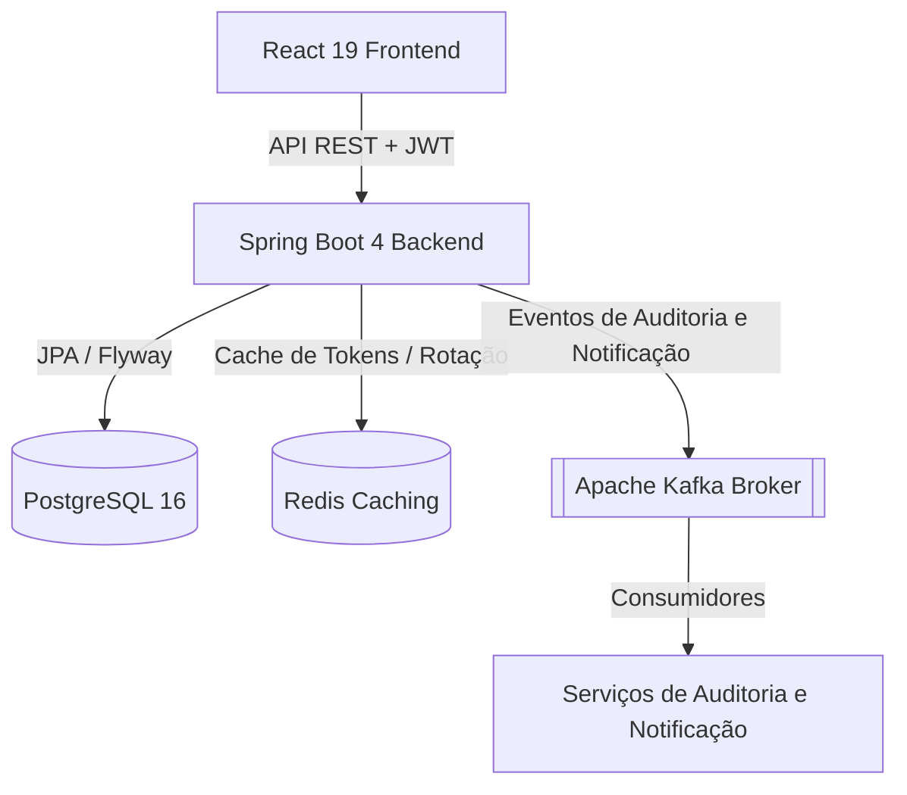
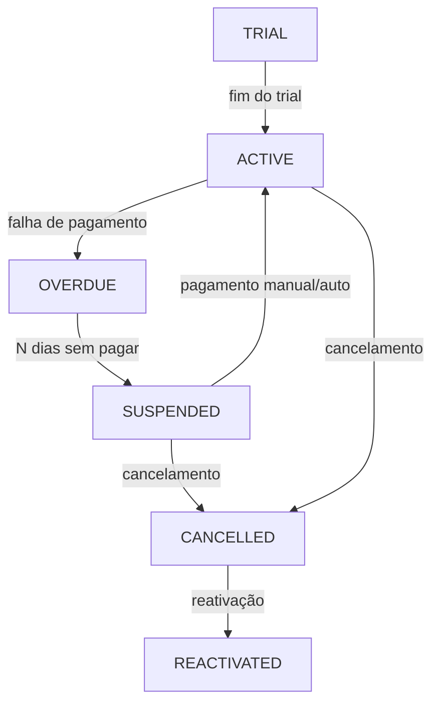

<div align="center">
  

# NEXUM

**Um Sistema Moderno de Gestão de Clientes e Assinaturas B2B SaaS**

[](https://github.com/OdevMatheus/nexus-monorepo/actions)
[](https://github.com/OdevMatheus/nexus-monorepo/stargazers)
[](https://openjdk.org)
[](https://spring.io/projects/spring-boot)
[](https://react.dev)
[](#licença)

---

🇺🇸 [English Version](../README.md)

</div>

---

## Sobre o Projeto

O **Nexum** é uma aplicação monorepo de nível enterprise e alta performance, projetada para gerenciar o ciclo de vida de assinaturas SaaS complexas, faturamento e dados de clientes. Com um backend robusto orientado a eventos e um frontend altamente responsivo e ricamente animado, oferece ferramentas completas para a gestão moderna de assinaturas e interação com clientes.

---

## ✨ Funcionalidades Principais

- **Máquina de Estados de Assinatura:** Controle total (manual e automatizado) do ciclo de vida (estados Trial, Active, Overdue, Suspended, Cancelled e Reactivated) com recálculo inteligente do ciclo de cobrança resetado a partir do pagamento.
- **Métricas e Dashboards Interativos:** Gráficos e indicadores animados mostrando Receita Recorrente Mensal (MRR), inadimplentes (Overdue) e assinaturas futuras (Upcoming) com modais detalhados e fluxos de ação direta.
- **Sistema Unificado de Notificações:** Fluxo de disparo de notificações pré-formatadas para WhatsApp, mapeando códigos de discagem internacional (DDI) localizados (Brasil +55, EUA +1, Portugal +351) para lembretes de faturamento amigáveis.
- **Sessões Seguras Multi-Abas:** Sessões JWT seguras suportadas por Redis e persistidas via `localStorage` com Rotação de Refresh Tokens, permitindo login persistente por até 7 dias e redirecionamento automático para o dashboard.
- **Arquitetura Orientada a Eventos:** Desacoplamento de logs de auditoria, compilação de métricas e disparo de notificações utilizando Apache Kafka.
- **Carga de Dados Realista (Seeder):** Script de carga que pré-popula o histórico realista de uma academia (*Carlos' FitLife Gym*), contendo assinaturas, faturamentos e transações ao longo de 2.4 anos para testes visuais imediatos.

---

## 🏗️ Arquitetura

### Arquitetura do Sistema
O Nexum utiliza uma arquitetura desacoplada e orientada a eventos para garantir que os domínios principais permaneçam escaláveis e altamente performáticos.



### Máquina de Estados do Ciclo de Vida de Assinaturas
O motor de faturamento do Nexum é governado por uma máquina de estados determinística:



---

## 🛠️ Stack Tecnológica

### Backend
- **Java 25** + **Spring Boot 4.0.6** (utilizando Spring Security, Spring Data JPA e Spring Kafka)
- Mapeamento relacional com **Hibernate 7** e migrações de esquema via **Flyway**
- Gerenciamento de tokens JWT (algoritmo HS512 com assunto UUID) via **JJWT 0.12.6**
- Manipuladores globais de erros desacoplados (`GlobalExceptionHandler`)

### Frontend
- **React 19** + **TypeScript** + **Vite 8** (Ferramenta de build)
- Tailwind CSS v4 (`@tailwindcss/vite`) & Vanilla CSS
- Sincronização de Estado/Servidor com **TanStack React Query**
- Animações e loops de feedback com **Framer Motion** & **Lucide Icons**

### Infraestrutura & Orquestração
- **PostgreSQL 16** (Banco de Dados Principal)
- **Redis** (Sessão & Cache de Tokens)
- **Apache Kafka** (Message Broker / Barramento de Eventos)
- **Docker** & **Docker Compose** (Orquestração de Ambiente Local)

---

## 🚀 Como Começar

### Pré-requisitos
Certifique-se de ter instalado localmente em sua máquina:
- **Docker** & **Docker Compose**
- **Java 25** (JDK) e **Node.js v20** (Necessário apenas para o Modo Desenvolvedor)

---

### Opção A: Início Rápido (Execução Local em Um Clique)

A forma mais simples e rápida de iniciar, testar e executar a aplicação completa localmente. Ela provisiona os containers do Docker em segundo plano, limpa qualquer conflito anterior de portas ou containers, carrega o histórico de dados realista e inicia automaticamente os servidores locais de backend e frontend.

1. **Iniciar a Aplicação:**
   Dê dois cliques no arquivo `run.cmd` localizado na raiz do projeto, ou execute o comando abaixo no PowerShell:
   ```powershell
   .\run.cmd
   ```
2. **Acessar a Aplicação:**
   - **Frontend App:** `http://localhost:5173`
   - **Backend API:** `http://localhost:8080`
   - **Documentação de API (Swagger UI):** `http://localhost:8080/swagger-ui/index.html`

*Credenciais de Login Padrão:* `teste@teste` / `teste123` (Usuário administrador Carlos da academia FitLife Gym)

*Para parar a aplicação:* Basta fechar as janelas de terminal abertas e parar os containers do docker.

---

### Opção B: Modo Desenvolvedor (Execução Manual)

Use este modo caso queira rodar o backend e o frontend em ambientes locais de desenvolvimento/hot-reload.

#### 1. Configuração da Infraestrutura
Suba os containers de PostgreSQL, Redis e Kafka:
```powershell
cd docker
docker compose up -d
```
*Serviços disponíveis em:* PostgreSQL (`localhost:5432`), Redis (`localhost:6379`), Kafka (`localhost:9092`).

#### 2. Configuração e Execução do Backend
Crie um arquivo `.env` dentro do diretório `backend/` com as seguintes variáveis:
```env
JWT_SECRET=your_jwt_secret_key_minimum_512_bits_long
RESEND_API_KEY=re_your_resend_api_key
RESEND_FROM_EMAIL=onboarding@resend.dev
APP_BASE_URL=http://localhost:8080
```

Inicie o servidor Spring Boot:
```powershell
cd backend
.\mvnw clean compile
.\mvnw spring-boot:run
```

#### 3. Configuração e Execução do Frontend
Instale as dependências e inicie o servidor de desenvolvimento Vite:
```powershell
cd frontend
npm install
npm run dev
```

---

## 🧪 Testes & Validação

### Testes do Backend (Unitários & Integração)
Os testes de integração estendem a classe `IntegrationTestBase` e sobem instâncias efêmeras de Postgres/Kafka utilizando **Testcontainers** para validar a consistência transacional.
Para executar a suíte completa de testes:
```powershell
cd backend
.\mvnw test
```

### Validações do Frontend (Linter & Compilação)
Para rodar as checagens do linter de código e do compilador do TypeScript:
```powershell
cd frontend
npm run lint
npx tsc --noEmit
```

---

## 📁 Estrutura do Projeto

```
.github/
└── workflows/
    └── ci.yml
backend/
├── .mvn/
│   └── wrapper/
│       └── maven-wrapper.properties
├── src/
│   ├── main/
│   │   ├── java/
│   │   └── resources/
│   └── test/
│       ├── java/
│       └── resources/
├── .gitattributes
├── .gitignore
├── mvnw
├── mvnw.cmd
└── pom.xml
docker/
└── docker-compose.yml
docs/
└── README.pt-BR.md
frontend/
├── public/
│   └── favicon.svg
├── src/
│   ├── assets/
│   ├── components/
│   ├── contexts/
│   ├── hooks/
│   ├── pages/
│   ├── routes/
│   ├── services/
│   ├── styles/
│   ├── types/
│   ├── Utils/
│   ├── App.tsx
│   └── main.tsx
├── .gitignore
├── eslint.config.js
├── index.html
├── package-lock.json
├── package.json
├── tsconfig.app.json
├── tsconfig.json
├── tsconfig.node.json
└── vite.config.ts
├── .gitignore
├── README.md
└── run.cmd
```

---

## 📖 Documentação

| Recurso | Descrição |
|---|---|
| [Módulo de API Backend](./backend.pt-BR.md) | Documentação detalhada sobre a API REST com Java 25 e Spring Boot 4, testes e ciclos. |
| [Módulo do App Frontend](./frontend.pt-BR.md) | Documentação detalhada sobre a SPA em React 19 e TypeScript, sincronização e UX/UI. |
| [Módulo de Infraestrutura Docker](./docker.pt-BR.md) | Documentação detalhada sobre os serviços em containers com Postgres, Redis e Kafka. |
| [English Version (README.md)](../README.md) | Documentação completa do projeto em Inglês. |

---

## 📄 Licença

Este projeto é proprietário e confidencial. Todos os direitos reservados.

---
