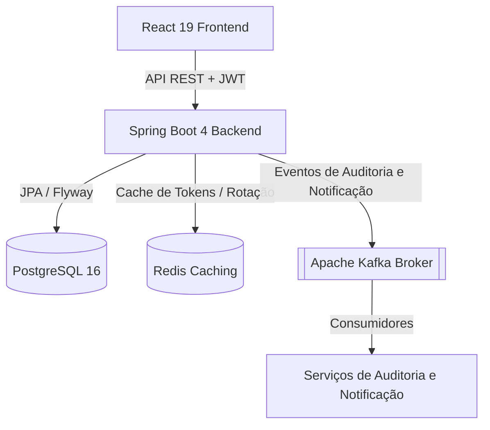
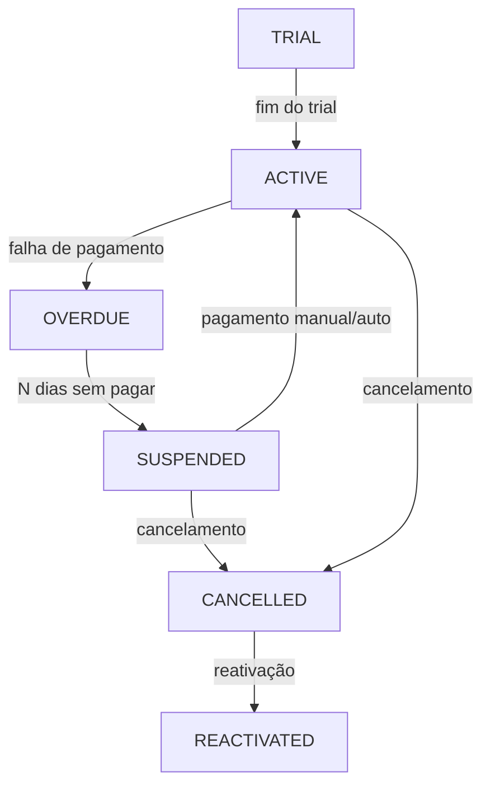

<div align="center">
  

# NEXUM

**Um Sistema Moderno de Gestão de Clientes e Assinaturas B2B SaaS**

[](https://github.com/OdevMatheus/nexus-monorepo/actions)
[](https://github.com/OdevMatheus/nexus-monorepo/stargazers)
[](https://openjdk.org)
[](https://spring.io/projects/spring-boot)
[](https://react.dev)
[](#licença)

---

🇺🇸 [English Version](../README.md)

</div>

---

## Sobre o Projeto

O **Nexum** é uma aplicação monorepo de alta performance e nível enterprise projetada para gerenciar o ciclo de vida de assinaturas complexas SaaS, faturamento e dados de clientes. O sistema conta com um backend robusto orientado a eventos e um frontend altamente responsivo e ricamente animado.

## ✨ Funcionalidades Principais

- **Máquina de Estados de Assinatura:** Controle automatizado e manual sobre ciclos de vida complexos de assinaturas (Trial, Ativa, Atrasada/Overdue, Suspensa, Cancelada).
- **Dashboard Interativo:** Painel analítico rico e animado (`framer-motion`), fornecendo insights sobre Assinaturas Ativas por Plano, Receita Recorrente Mensal (MRR) e pagamentos atrasados ou futuros.
- **Mecanismo Avançado de Filtragem:** Busca e filtragem dinâmica de assinaturas aproveitando Spring Data JPA Specifications.
- **Arquitetura Orientada a Eventos:** Integração com Apache Kafka para auditoria, notificações e desacoplamento da lógica de negócios.
- **Autenticação Segura:** Autenticação baseada em JWT com Rotação de Refresh Tokens e gerenciamento de sessões suportado por cache em Redis.

---

## 🏗️ Arquitetura

### Arquitetura do Sistema
O Nexum utiliza uma arquitetura desacoplada e orientada a eventos para garantir que os domínios principais permaneçam escaláveis e altamente performáticos.



### Máquina de Estados do Ciclo de Vida de Assinaturas
O núcleo do Nexum gira em torno de uma máquina de estados determinística que gerencia os ciclos de faturamento:



---

## 🛠️ Stack Tecnológica

### Backend
- **Java 25** + **Spring Boot 4.0.6**
- Spring Security, Spring Data JPA, Spring Kafka
- Migrações de Banco de Dados com **Flyway**
- JWT (JJWT) para Autenticação

### Frontend
- **React 19** + **TypeScript**
- **Vite 8** (Ferramenta de build)
- **Tailwind CSS v4** (`@tailwindcss/vite`)
- React Query (TanStack), Framer Motion, Lucide Icons

### Infraestrutura & Orquestração
- **PostgreSQL 16** (Banco de Dados Principal)
- **Redis** (Gerenciamento de Tokens & Cache)
- **Apache Kafka** (Barramento de Mensagens / Eventos)
- **Docker Compose** (Ambiente Local)

---

## 🚀 Como Começar

### Pré-requisitos
Antes de iniciar, certifique-se de ter instalado em sua máquina:
- **Java 25** (JDK)
- **Node.js** (v20+ recomendado) & **npm**
- **Docker** & **Docker Compose**

### 1. Configuração da Infraestrutura
Inicie a infraestrutura local (banco de dados, cache e message broker) usando Docker:
```powershell
cd docker
docker compose up -d
```
*Serviços disponíveis em:* PostgreSQL (`localhost:5432`), Redis (`localhost:6379`), Kafka (`localhost:9092`).

### 2. Configuração e Execução do Backend
Crie um arquivo `.env` dentro do diretório `backend/` com as seguintes variáveis:
```env
JWT_SECRET=your_jwt_secret_key_minimum_512_bits_long
RESEND_API_KEY=re_your_resend_api_key
RESEND_FROM_EMAIL=onboarding@resend.dev
APP_BASE_URL=http://localhost:8080
```

Inicie o servidor Spring Boot:
```powershell
cd backend
.\mvnw clean compile
.\mvnw spring-boot:run
```
*A API estará disponível em `http://localhost:8080`.*

### 3. Configuração e Execução do Frontend
Instale as dependências e inicie o servidor de desenvolvimento Vite:
```powershell
cd frontend
npm install
npm run dev
```
*A interface de usuário estará disponível em `http://localhost:5173`.*

---

## 🧪 Testes & Validação

O projeto possui uma suíte abrangente de testes unitários e de integração. Os testes de integração utilizam **Testcontainers** para subir instâncias efêmeras de PostgreSQL e Kafka no Docker.

Para executar os testes do backend:
```powershell
cd backend
.\mvnw test
```

Para executar os linters e type checkers do frontend:
```powershell
cd frontend
npm run lint
npx tsc --noEmit
```

---

## 📁 Estrutura do Projeto

```
.github/
└── workflows/
    └── ci.yml
backend/
├── .mvn/
│   └── wrapper/
│       └── maven-wrapper.properties
├── src/
│   ├── main/
│   │   ├── java/
│   │   └── resources/
│   └── test/
│       ├── java/
│       └── resources/
├── .gitattributes
├── .gitignore
├── mvnw
├── mvnw.cmd
└── pom.xml
docker/
└── docker-compose.yml
docs/
├── auth/
│   ├── decisions.md
│   └── overview.md
└── specs/
    ├── 2026-06-06-notifications-hybrid-design.md
    ├── 2026-06-06-subscription-search-design.md
    ├── 2026-06-07-dashboard-active-modal-design.md
    ├── 2026-06-07-manual-payment-flow.md
    └── 2026-06-08-advanced-subscription-filtering.md
frontend/
├── public/
│   └── favicon.svg
├── src/
│   ├── assets/
│   ├── components/
│   ├── contexts/
│   ├── hooks/
│   ├── pages/
│   ├── routes/
│   ├── services/
│   ├── styles/
│   ├── types/
│   ├── Utils/
│   ├── App.tsx
│   └── main.tsx
├── .gitignore
├── eslint.config.js
├── index.html
├── package-lock.json
├── package.json
├── tsconfig.app.json
├── tsconfig.json
├── tsconfig.node.json
└── vite.config.ts
.gitignore
commit-guide.md
GEMINI.md
README.md
Rodar.txt
Subscription.md
```

---

## 📖 Documentação

| Recurso | Descrição |
|---|---|
| [GEMINI.md](../GEMINI.md) | Mandatos fundamentais, padrões de código, convenções de backend/frontend e arquitetura. |
| [Design do Ciclo de Vida de Assinatura](../Subscription.md) | Especificações técnicas e fluxo de trabalho da máquina de estados de assinatura. |
| [Visão Geral da Arquitetura de Autenticação](./auth/overview.md) | Passo a passo abrangente do JWT, tratamento de sessões e controle de acesso. |
| [Decisões sobre Arquitetura de Autenticação](./auth/decisions.md) | Decisões arquiteturais e de design referentes à segurança e autenticação. |
| [Design de Notificação Híbrida](./specs/2026-06-06-notifications-hybrid-design.md) | Especificação para o sistema híbrido de notificações em segundo plano e em tempo real. |
| [Especificação de Busca de Assinaturas](./specs/2026-06-06-subscription-search-design.md) | Esboço técnico de busca textual completa e pesquisas sobre assinaturas. |
| [Design do Modal Ativo no Dashboard](./specs/2026-06-07-dashboard-active-modal-design.md) | Especificações de design para modais de sobreposição no painel. |
| [Fluxo de Pagamento Manual](./specs/2026-06-07-manual-payment-flow.md) | Documentação de tratamento de transações de faturamento de forma manual na máquina de estados. |
| [Filtragem Avançada de Assinaturas](./specs/2026-06-08-advanced-subscription-filtering.md) | Especificações técnicas de filtros dinâmicos com Spring Data JPA Specifications. |
| [Guia de Commit](../commit-guide.md) | Diretrizes e padrões para redigir mensagens de commit limpas e semânticas. |

---

## 🤝 Contribuição

Contribuições são super bem-vindas! Certifique-se de revisar o [Guia de Commit](../commit-guide.md) e o [GEMINI.md](../GEMINI.md) para fluxos de desenvolvimento, padrões de codificação e padrões de branch antes de submeter pull requests.

<a href="https://github.com/OdevMatheus/nexus-monorepo/graphs/contributors">
  
</a>

---

## 📄 Licença

Este projeto é proprietário e confidencial.

---

<div align="center">

[](https://star-history.com/#OdevMatheus/nexus-monorepo&Date)

</div>