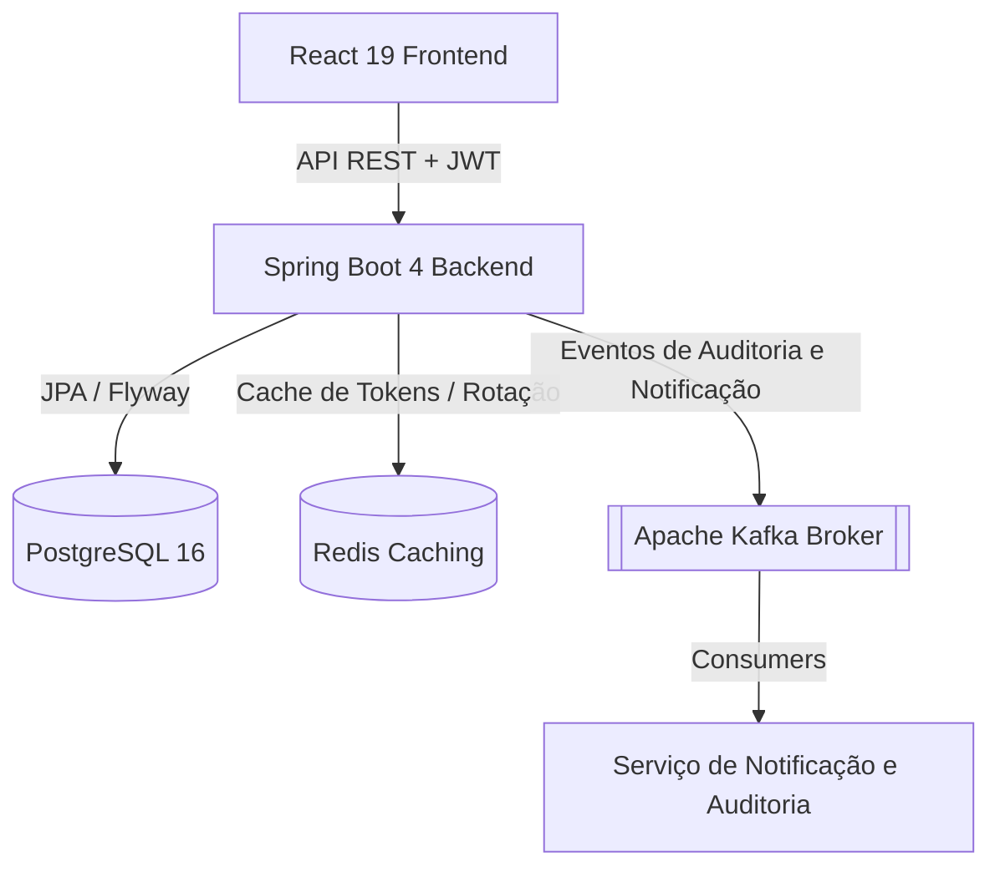
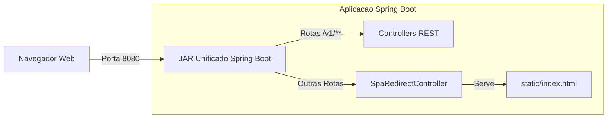
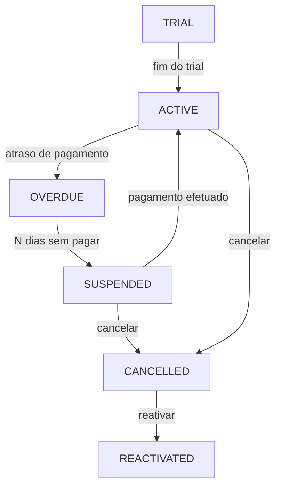

<div align="center">
  

# NEXUM

**Um Sistema Moderno, Pronto para Produção, de Gestão de Clientes e Assinaturas B2B SaaS**

[](https://github.com/OdevMatheus/nexus-monorepo/actions)
[](https://github.com/OdevMatheus/nexus-monorepo/stargazers)
[](https://openjdk.org)
[](https://spring.io/projects/spring-boot)
[](https://react.dev)
[](https://tailwindcss.com)
[](#licença)

---

🇺🇸 [English Version](../README.md)

</div>

---

## 📖 O que é isso?

O **Nexum** é uma aplicação monorepo de nível enterprise e alta performance, projetada para gerenciar o ciclo de vida de assinaturas SaaS complexas, faturamento e dados de clientes B2B. 

Com um backend robusto orientado a eventos e um frontend altamente responsivo e ricamente animado, o sistema oferece ferramentas completas para a gestão moderna de assinaturas e interação com clientes. Ele é totalmente otimizado para produção, oferecendo opções de implantação com containers independentes ou através de um único JAR unificado auto-executável, que serve tanto a API quanto os recursos estáticos do frontend, eliminando quaisquer conflitos de CORS.

---

## ✨ Funcionalidades Principais

- ⚙️ **Máquina de Estados de Assinatura:** Controle total (manual e automatizado) do ciclo de vida (estados Trial, Active, Overdue, Suspended, Cancelled e Reactivated) com recálculos inteligentes de ciclo de faturamento resetados a partir da data de pagamento, evitando acúmulos retroativos.
- 📊 **Métricas e Dashboards Interativos:** Gráficos e cards animados mostrando Receita Recorrente Mensal (MRR), inadimplentes (Overdue) e assinaturas futuras (Upcoming) com modais detalhados e fluxos de ação direta.
- 💬 **Sistema de Notificações WhatsApp Unificado:** Fluxos de disparo de notificações pré-formatadas para WhatsApp, mapeando códigos de discagem internacional (DDI) localizados (Brasil `+55`, EUA `+1`, Portugal `+351`) para lembretes de faturamento amigáveis e automáticos.
- 👤 **Configurações de Conta e Perfil:** Portal de configurações totalmente desacoplado onde o usuário autenticado pode editar dados pessoais (Nome, E-mail) e alterar a senha com segurança sob regras criptográficas rigorosas e regras de invalidação de sessão.
- 🔄 **Sessões Multi-Abas Seguras:** Autenticação via JWT suportada por Redis e persistida via `localStorage` com Rotação de Refresh Tokens (RTR), permitindo login persistente por até 7 dias, redirecionamento de rotas e invalidação de sessão imediata após atualizações de segurança críticas de perfil.
- ⚡ **Arquitetura Orientada a Eventos:** Desacoplamento completo de logs de auditoria, compilação de métricas e processamento de notificações usando o Apache Kafka.
- 📦 **Empacotamento Unificado de Produção:** Roteamento do Single Page Application (SPA) através de um `SpaRedirectController` customizado, que redireciona atualizações de rota amigáveis do navegador (ex: `/dashboard`, `/settings`) de volta para o `/index.html`, permitindo rodar frontend e backend sob a mesma porta (`8080`) e o mesmo JAR.
- 🌱 **Carga de Dados Realista (Seeder):** Script de carga que pré-popula o histórico realista de uma academia (*Carlos' FitLife Gym*), contendo assinaturas, faturamentos e transações ao longo de 2.4 anos para testes visuais imediatos.

---

## 🏗️ Arquitetura

### Arquitetura do Sistema
O Nexum utiliza uma arquitetura desacoplada e orientada a eventos para garantir alta escalabilidade e performance.



### Implantação de Produção (Pacote Unificado)
Para facilidade de deploy, o Nexum é empacotado em uma imagem única onde o JAR do Spring Boot hospeda e roteia os arquivos estáticos do frontend React localmente.



### Máquina de Estados de Assinatura
O motor de cobrança e faturamento segue uma máquina de estados determinística:



---

## 🛠️ Stack Tecnológica

### Backend
- **Java 25** + **Spring Boot 4.0.6** (utilizando Spring Security, Spring Data JPA e Spring Kafka)
- Mapeamento relacional com **Hibernate 7** e migrações de banco gerenciadas com **Flyway**
- Gestão de tokens JWT (algoritmo HS512 e sujeito explicitamente como UUID) via **JJWT 0.12.6**
- Controle de cache e tokens de refresh via **Redis**
- Validações personalizadas e manipulação centralizada de erros REST (`GlobalExceptionHandler`)

### Frontend
- **React 19** + **TypeScript** + **Vite 8** (Ferramenta de build)
- Tailwind CSS v4 (`@tailwindcss/vite`) & Vanilla CSS
- Sincronização de Estado/Servidor com **TanStack React Query**
- Micro-animações e ícones elegantes com **Framer Motion** & **Lucide Icons**

### Infraestrutura & Orquestração
- **PostgreSQL 16** (Banco de dados principal)
- **Redis** (Cache de sessão e revogação de tokens)
- **Apache Kafka** (Broker de mensageria / barramento de eventos)
- **Docker** & **Docker Compose** (Orquestração do ambiente local de infraestrutura)

---

## 🚀 Como Começar

### Pré-requisitos
Certifique-se de possuir instalado localmente:
- **Docker** & **Docker Compose**
- **Java 25** (JDK) e **Node.js v20** (Necessários apenas para o Modo Desenvolvedor)

---

### Opção A: Execução Rápida (Um Clique)

A maneira mais fácil de iniciar, testar e rodar o projeto completo localmente. O script limpa conflitos de portas, remove containers antigos do Docker, inicializa toda a infraestrutura em background, semeia dados realistas de 2.4 anos e sobe o sistema automaticamente baseado na sua preferência.

1. **Iniciar a Aplicação:**
   Dê um duplo clique no arquivo `run.cmd` localizado na raiz do projeto, ou execute-o via PowerShell:
   ```powershell
   .\run.cmd
   ```
2. **Escolha o Modo de Execução:**
   - **Modo [1] Modo Desenvolvimento:** Inicia os servidores de desenvolvimento de forma separada (Frontend na porta `5173`, Backend na porta `8080`). Ideal para escrever código com Hot-Reload.
   - **Modo [2] Modo Unificado:** Compila o frontend React automaticamente, copia para a pasta estática do Spring Boot e inicia uma única instância central na porta `8080`. Perfeito para testes, staging ou demonstração técnica simples.

3. **Acessar o Sistema:**
   - **Aplicação Unificada / API Backend:** `http://localhost:8080` (Acesse essa URL se rodar no Modo Unificado)
   - **Frontend UI (Modo Dev):** `http://localhost:5173` (Acesse essa URL se rodar no Modo Dev)
   - **Documentação da API (Swagger UI):** `http://localhost:8080/swagger-ui/index.html`

*Credenciais Padrão de Login:* `teste@teste` / `teste123` (Conta administrativa do Carlos na Academia FitLife Gym)

*Para parar o sistema:* Apenas feche as janelas abertas do terminal.
*Para limpar completamente o ambiente (containers, volumes, compilações):* Dê um duplo clique no arquivo `clean-all.cmd` ou execute `.\clean-all.cmd`.

---

### Opção B: Modo Desenvolvedor Manual

Utilize este método caso prefira rodar o frontend e backend manualmente por terminais distintos em modo watch.

#### 1. Inicializar Infraestrutura
Suba os serviços PostgreSQL, Redis e Kafka usando Docker Compose:
```powershell
cd docker
docker compose up -d
```
*Serviços expostos em:* PostgreSQL (`localhost:5432`), Redis (`localhost:6379`), Kafka (`localhost:9092`).

#### 2. Configurar e Executar o Backend
Crie um arquivo `.env` na raiz do diretório `backend/` com as seguintes chaves:
```env
JWT_SECRET=sua_chave_secreta_jwt_de_no_minimo_512_bits
RESEND_API_KEY=re_sua_chave_api_do_resend
RESEND_FROM_EMAIL=onboarding@resend.dev
APP_BASE_URL=http://localhost:8080
```

Compile e execute o servidor Spring Boot:
```powershell
cd backend
.\mvnw clean compile
.\mvnw spring-boot:run
```

#### 3. Configurar e Executar o Frontend
Instale as dependências e inicie o servidor local de desenvolvimento do Vite:
```powershell
cd frontend
npm install
npm run dev
```

---

## 🧪 Testes & Qualidade de Código

### Testes do Backend (Unitários & Integração)
Os testes de integração estendem `IntegrationTestBase` e usam o **Testcontainers** para subir instâncias efêmeras isoladas em Docker de **PostgreSQL 16** e **Apache Kafka**. Isso valida os fluxos transacionais perfeitamente sem poluir ou depender de um banco de dados local.

Para rodar toda a suíte de testes:
```powershell
cd backend
.\mvnw test
```

### Verificação do Frontend (Linter & Compilação)
Para rodar a verificação sintática e de tipagem estática do TypeScript:
```powershell
cd frontend
npm run lint
npx tsc --noEmit
```

---

## 📁 Estrutura do Projeto

```
.github/
└── workflows/
    └── ci.yml
backend/
├── src/
│   ├── main/
│   │   ├── java/com/matheushenrique/nexum/
│   │   │   ├── config/             # Segurança, CORS, Redirecionamento SPA
│   │   │   ├── controllers/        # Autenticação, Clientes, Usuários/Configurações, Métricas
│   │   │   ├── dtos/               # Records Java de requisições e respostas
│   │   │   ├── entities/           # Entidades JPA mapeadas com anotações Lombok
│   │   │   ├── messaging/          # Produtores e Consumidores Kafka
│   │   │   ├── repositories/       # Repositórios JPA
│   │   │   └── services/           # Camadas de serviço e implementações de lógica
│   │   └── resources/
│   │       ├── db/migration/       # Migrações incrementais SQL do Flyway (V1 a V10)
│   │       └── application.yaml    # Configurações parametrizadas dinamicamente
│   └── test/
│       ├── java/                   # Testes unitários e de integração (Testcontainers)
│       └── resources/
├── mvnw
├── mvnw.cmd
└── pom.xml
docker/
└── docker-compose.yml
docs/
├── specs/                          # Especificações técnicas e de design
└── README.pt-BR.md                 # Documentação em Português (Este arquivo)
frontend/
├── public/
│   └── favicon.svg
├── src/
│   ├── components/                 # Modals, Gráficos, Landing Page e Layout
│   ├── contexts/                   # AuthContext e ThemeContext
│   ├── hooks/                      # Custom hooks envolvendo chamadas do React Query
│   ├── pages/                      # Páginas da aplicação (Dashboard, Settings, Auth)
│   ├── services/                   # Chamadas REST com Axios para a API
│   ├── styles/                     # Estilos globais e diretivas do Tailwind v4
│   └── Utils/                      # Formatadores de telefone e títulos dinâmicos
├── eslint.config.js
├── index.html
├── package.json
└── vite.config.ts
clean-all.cmd                       # Script de limpeza profunda do ambiente
Dockerfile                          # Dockerfile multi-stage pronto para produção
run.cmd                             # Script interativo de inicialização rápida
```

---

## 📖 Documentação

| Recurso | Descrição |
|---|---|
| [Módulo API Backend](./backend/README.md) | Documentação detalhada sobre a API REST Java 25 + Spring Boot 4, testes e ciclo de faturamento. |
| [Módulo Frontend App](./frontend/README.md) | Documentação detalhada sobre o SPA em React 19 + TypeScript, sincronização e UX/UI. |
| [Módulo de Infraestrutura Docker](./docker/README.md) | Documentação sobre os containers locais de banco PostgreSQL, cache Redis e mensageria Kafka. |
| [English Version (README.md)](../README.md) | Documentação de entrada do repositório em Inglês. |

---

## 📄 Licença

Este projeto é confidencial e proprietário. Todos os direitos reservados.

---
